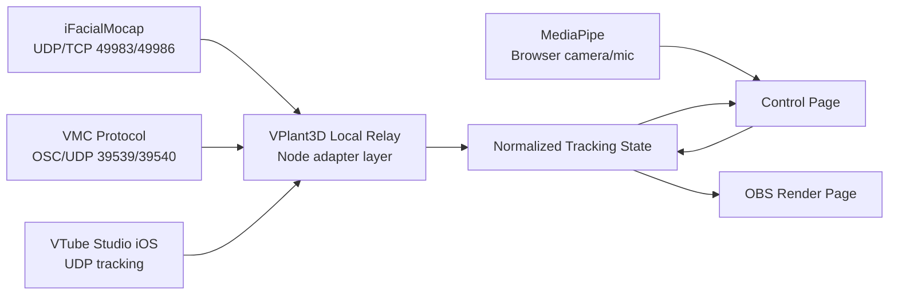

# 外部トラッキング接続調査

調査日: 2026-05-22

## 結論

VPlant3Dで外部トラッキングを扱うなら、ブラウザへ直接つなぐのではなく、ローカル中継サーバーで受けて、既存のControl Page / OBS Render PageへWebSocketで流す設計がよい。

理由は、主要な外部トラッキング系がUDPまたはOSC over UDPを使うため。OBS Browser Sourceや通常ブラウザは、WebSocketクライアントとしては扱いやすい一方で、ローカルUDPを直接listenする用途には向かない。今あるVPlant3DのローカルWebSocket relayを拡張して、外部トラッキング入力を正規化する方が自然。

優先度は「任意の追加機能」。MediaPipe内蔵トラッキングだけでMVPは成立するが、iPhone顔トラッキングやVMC対応を入れると、OBS内カメラ権限問題を回避しやすく、外部ツール資産とも接続できる。ハッカソンの差別化としては「OBS向けブラウザVRMレイヤーが、内蔵MediaPipeと外部トラッカーを同じUIで切り替えられる」が強い。

## 調査対象

### VMC Protocol

VMC Protocolは、VRMアバター向けのモーション通信プロトコル。公式仕様ではOpen Sound Control over UDP/IPを使い、ローカルマシンまたはローカルネットワーク上で、ボーン情報、BlendShape情報、カメラ、ライト、トラッカー、視線などを送受信できる。

VMCの役割分担は以下。

| 役割 | 内容 | 一般的なポート |
| --- | --- | --- |
| Marionette | モーションを受け取り描画する側 | 39539 |
| Performer | モーション処理、IK、全身ボーンを送る側 | 39539へ送信、39540で受信 |
| Assistant | 表情や一部ボーンなど補助情報を送る側 | 39540へ送信 |

VPlant3Dは、OBSに描画を出すアプリなのでVMCの分類ではMarionette寄り。ただし現状の設計ではControl PageがMediaPipeでトラッキングし、OBS Render Pageへ流しているため、ローカル中継サーバーを置くなら「VMC入力を受けるAssistant/Performer adapter」でもあり、「OBSへ描画するMarionette」でもある。

対応候補は以下。

- `/VMC/Ext/Bone/Pos`: VRMボーン姿勢
- `/VMC/Ext/Blend/Val`: 表情BlendShape値
- `/VMC/Ext/Blend/Apply`: BlendShape適用タイミング
- `/VMC/Ext/Root/Pos`: ルート姿勢
- `/VMC/Ext/T`: 疎通確認用の相対時刻

まずは表情と頭だけ受ける最小実装がよい。全身ボーンを受けると、現状のMediaPipe補正、VRMA再生、アイドル揺らぎとの優先順位設計が一気に難しくなる。

### iFacialMocap

iFacialMocapは、iPhone FaceIDまたはWebcamで顔の動きを取得し、PC側へフェイシャルデータを送るアプリ。公式開発者向けページでは、PCソフトを介さずにUDPまたはTCP/IPで受信できると説明されている。

重要な通信仕様は以下。

| 項目 | 内容 |
| --- | --- |
| UDP開始 | PCからiOS側49983番ポートへ開始文字列を送る |
| UDP受信 | PC側49983番ポートで受信 |
| 更新頻度 | 通常60FPS、長時間利用や端末発熱時は30FPSへ低下 |
| データ | BlendShape名と0から100の値、head、rightEye、leftEye |
| 角度 | ラジアンではなくdegree |
| v2形式 | `sendDataVersion=v2` を指定するとBlendShape名と値の区切りが `&` になる |
| TCP/IP | UDPでフレーム落ちする場合の代替あり。PC側49986番ポートへ送信される |

VPlant3Dへ入れる場合は、独自文字列パーサーをローカル中継サーバー側に置く。ブラウザ側に入れるべきではない。

正規化の方向性は以下。

| iFacialMocap | VPlant3D内部 |
| --- | --- |
| `eyeBlink_L`, `eyeBlink_R` | `blinkLeft`, `blinkRight` |
| `jawOpen`, `mouthFunnel`, `mouthPucker` | VRMの `aa`, `ou`, `oh` などへ重み変換 |
| `mouthSmile_L/R` | `happy` または笑顔補助 |
| `browInnerUp`, `browOuterUp_*` | `surprised` 補助 |
| `=head#` の回転 | head yaw / pitch / roll |
| `rightEye#`, `leftEye#` | 視線。ただし現状はカメラ向き固定方針なので低優先 |

iFacialMocapは顔専用の品質向上に向く。体や手は別入力のままにして、「顔/口」だけiFacialMocapへ切り替えられるUIにするのが現実的。

### VTube Studio API / VTube Studio iOS tracking

VTube StudioはLive2D向けツールで、VRM自体は対象外。ただし外部接続の参考になる点が多い。

公式GitHubによると、VTube Studio Public APIはWebSocketで動き、既定URLは `ws://localhost:8001`。ユーザーがVTube Studio側でPlugin API accessを許可し、プラグイン認証トークンを取得する必要がある。

APIでできることのうち、VPlant3Dに関係しそうなものは以下。

- 現在モデルやパラメータ値の取得
- カスタムパラメータの追加
- デフォルトまたはカスタムパラメータへの値注入
- イベント購読
- ホットキー実行

VTube StudioのiOSアプリから直接トラッキングデータを受け取る公式サンプルもある。これはWebSocket APIではなくUDPで、iPhone側の `3rd Party PC Clients` を有効化し、PCからiPhoneへ一定時間分の送信リクエストを送り続ける方式。送られる内容は、52個のiOS raw blendshape、head position、head rotation、左右目回転など。

VPlant3Dから見ると、VTube Studio連携は2種類に分けるべき。

| 方向 | 意味 | 優先度 |
| --- | --- | --- |
| VTube Studio iOS trackingを受信 | iPhone顔トラッカーとして使う | 中 |
| VTube Studio Public APIへ送信 | VTSのLive2Dモデルを制御する | 低 |

VPlant3DはVRM描画アプリなので、VTS本体のLive2Dモデル操作は主目的から外れる。使うならiOS tracking受信の方が近い。

## 推奨アーキテクチャ



中継サーバーの責務は以下。

1. UDP / TCP / OSC / WebSocketなど外部プロトコルを受ける
2. 入力ごとの差をVPlant3D内部形式へ正規化する
3. Control Pageへ状態表示、OBS Render Pageへ描画用状態を配信する
4. 入力が途切れた時は急にゼロへ戻さず、現在のslow release方針に合わせる

内部形式の候補。

```ts
type ExternalTrackingSource = "off" | "mediapipe" | "ifacialmocap" | "vmc" | "vtube-studio-ios";

type NormalizedExternalTracking = {
  timestampMs: number;
  source: ExternalTrackingSource;
  face?: {
    found: boolean;
    headYaw: number;
    headPitch: number;
    headRoll: number;
    blinkLeft: number;
    blinkRight: number;
    mouthAa: number;
    mouthIh: number;
    mouthOu: number;
    happy: number;
    surprised: number;
  };
  body?: {
    rootYaw?: number;
    chestYaw?: number;
    chestRoll?: number;
    leftArm?: unknown;
    rightArm?: unknown;
  };
  hands?: {
    left?: unknown;
    right?: unknown;
  };
};
```

この型は実装時に既存の `RelayRenderState` と揃える。いきなり全部作らず、最初は `face` だけでよい。

## UI方針

今の「まばたき」「口」「体トラック」「手」の入力切り替え方針と相性がよい。

- まばたき: `モーキャプ` / `自動` / `iFacialMocap` / `VMC` / `オフ`
- 口: `モーキャプ` / `マイク` / `iFacialMocap` / `VMC` / `オフ`
- 頭: `体トラック` / `iFacialMocap` / `VMC` / `固定`
- 体: `MediaPipe` / `VMC` / `アイドル揺らぎ` / `オフ`
- 手: `MediaPipe` / `VMC` / `オフ`

外部接続は、接続状態、最終受信時刻、受信FPS、ポート、最後のエラーだけ見える小さな診断パネルで十分。配信中に触る操作ではないので、通常操作より下に置く。

## 実装順

### Phase 1: 調査用adapterの骨組み

- `server/external-tracking/` を作る
- 正規化型とsource別adapter interfaceだけ作る
- まだ依存は増やさない
- サンプル文字列を使ったiFacialMocap parserの純粋関数テストを書く

### Phase 2: iFacialMocap UDP/TCP受信

- Node側でUDP 49983を受ける
- v2形式を優先してパースする
- head / blink / mouthだけ内部状態へ変換する
- Control Pageに「外部顔トラッキング受信中」を出す

### Phase 3: VMC OSC受信

- OSC parse用ライブラリを追加する
- `39539` 受信を初期値にしつつ、ポート変更可能にする
- `/VMC/Ext/Blend/Val` と `/VMC/Ext/Blend/Apply` だけ先に対応する
- 次に `/VMC/Ext/Bone/Pos` のhead/chestのみ対応する

### Phase 4: VTube Studio iOS tracking検討

- iPhoneにVTube Studioを入れている人向けの任意機能として扱う
- VTS Public APIではなく、iOS tracking UDP受信を優先する
- VTS Public APIは将来の連携、ホットキー、比較検証用に留める

## リスク

- ネットワーク設定、Firewall、同一LAN、iPhone IP固定などで人間確認が必要
- iFacialMocapやVTube Studio iOS trackingは実機がないと品質確認できない
- UDPはブラウザ直ではなくローカル中継が必要
- 顔トラッキングとMediaPipe頭/体トラッキングを同時に使うと、頭の二重適用が起きやすい
- VRM表情はモデルごとに表情名や表情の強さが異なるため、プリセットだけでなく係数調整が必要
- VMC全身ボーン受信はVRMA、アイドル揺らぎ、手トラックとの優先順位設計が必要

## 人間に確認してほしいこと

- iFacialMocapを使う予定があるか。使うならiPhone FaceID端末か、Webcam/NVIDIA版か
- iFacialMocapのライセンスや購入可否
- VTube Studio iOS trackingを外部顔トラッカーとして使う予定があるか
- VMC送信元として想定するアプリ。例: VSeeFace、Waidayo、Virtual Motion Capture、MocapForAllなど
- OBS配信時に、外部トラッカー用ローカル中継サーバーを起動する運用を許容できるか

## 参考リンク

- [VMC Protocol specification](https://protocol.vmc.info/english.html)
- [VMC Protocol プロトコル仕様概要](https://protocol.vmc.info/specification.html)
- [iFacialMocapの通信仕様](https://www.ifacialmocap.com/for-developer/%E6%97%A5%E6%9C%AC%E8%AA%9E/)
- [VTube Studio API Development Page](https://github.com/DenchiSoft/VTubeStudio)
- [VTubeStudioBlendshapeUDPReceiverTest](https://github.com/DenchiSoft/VTubeStudioBlendshapeUDPReceiverTest)
- [ARFaceAnchor.BlendShapeLocation](https://developer.apple.com/documentation/arkit/arfaceanchor/blendshapelocation)
