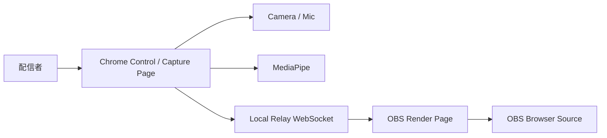

# OBS Architecture Redesign

## 目的

OBS Browser Source内でカメラ/マイク/MediaPipeまで完結させる方針を見直す。

OBS内のBrowser Sourceは、安定した透明描画レイヤーとして扱う。カメラ、マイク、ファイル選択、設定UI、MediaPipe処理は、Chromeまたは操作用ページへ分離する。

## 背景

OBS Browser SourceはCEFベースの埋め込みブラウザである。透明背景のHTML/CSS/JS描画には向くが、通常のChromeと同じ権限UIやデバイスアクセスを期待すると詰まりやすい。

OBS公式のBrowser Sourceドキュメントでは、Browser SourceはOBSに直接追加できるWebブラウザとして説明されており、幅/高さ、カスタムCSS、非表示時のshutdown、scene active時のrefreshなど、描画ソースとしての設定が中心である。OBS側のデフォルトCSSも透明背景、marginなし、overflow hiddenを前提にしている。

obs-browserのREADMEでは、OBS Browser SourceはCEF(Chromium Embedded Framework)ベースで、Web overlayやBrowser DockをOBSに統合するための仕組みとして説明されている。つまり、OBSのBrowser Sourceは「Chromeそのもの」ではなく、OBS内の描画/連携用ブラウザとして扱うのが安全である。

一方、通常ブラウザの `getUserMedia()` は安全なコンテキストとユーザー権限に依存する。Chromeで `localhost` を使う分には確認しやすいが、OBS内CEFで同じ許可UIとデバイス挙動を期待するのはMVPリスクが高い。

VPlant3Dでは、以下の問題が出た。

- `?transparent=1` なしではOBS側で背景が黒く見える
- OBS Browser Source内でカメラが取得できない
- Setup UI、ファイル選択、MediaPipe、描画を同じページに抱えた結果、OBS用と開発/操作用の責務が混ざった

このため、OBS向けHTML overlayで一般的な「表示ページ」と「操作/入力ページ」を分ける構成へ寄せる。

## 新しい基本方針

### 1. OBS Render Page

OBS Browser Sourceに置くページ。

例:

```text
http://127.0.0.1:5173/?obs=1&transparent=1
```

責務:

- VRM / VRMAの3D描画
- 透明背景
- UI非表示
- 1920x1080向けの安定レンダリング
- 中継サーバーから状態を受信

やらないこと:

- カメラ取得
- マイク取得
- MediaPipe推論
- ローカルファイル選択UI
- 操作用Setup Dock

### 2. Control / Capture Page

Chrome、または必要ならOBS Custom Browser Dockで開く操作ページ。

例:

```text
http://127.0.0.1:5173/?control=1
```

責務:

- VRM / VRMAファイル選択
- カメラ取得
- マイク取得
- MediaPipe Pose / Face / Hand推論
- 入力モード選択
- 表情プリセット
- アバター位置調整
- VRMAスロット管理
- OBS Render Pageへ送る状態の作成

原則として、カメラとマイクはChromeで確認する。OBS Dockでも動くなら便利機能として扱うが、MVPの必須動作環境にはしない。

### 3. Local Relay

OBS Render PageとControl / Capture Pageをつなぐローカル中継。

候補:

- WebSocketサーバー
- Vite middleware / Node server
- 将来は小さなデスクトップアプリ

責務:

- 最新のアプリ状態を保持
- Control / Capture Pageから状態を受信
- OBS Render Pageへ状態を配信
- 必要に応じてVRM / VRMAファイルをメモリまたはローカルURLとして配信

## 推奨構成



## 状態同期の考え方

Control / Capture Pageは、描画に必要な状態だけをOBS Render Pageへ送る。

送る状態の例:

- avatar transform
  - position
  - scale
  - rotation
- humanoid pose
  - head
  - neck
  - chest
  - upper arms
- expressions
  - blinkLeft
  - blinkRight
  - aa
  - happy
  - surprised
- VRMA playback command
  - selected slot
  - play
  - stop
  - loop

送らないもの:

- 生カメラ画像
- 生マイク音声
- MediaPipeの全landmarkログ
- Setup UI表示状態

## VRM / VRMAファイルの扱い

最大の設計課題は、Chromeで選んだローカルファイルをOBS Browser Sourceへどう渡すかである。

### MVP案 A: 両ページで同じファイルを選ぶ

実装が簡単。

短所:

- OBS側でもファイル選択が必要になり、Browser Source運用と相性が悪い
- 配信時の操作が面倒

MVPの本命にはしない。

### MVP案 B: Control PageがファイルをRelayへアップロードする

Control / Capture Pageで選んだVRM / VRMAをLocal Relayへ渡し、OBS Render PageはRelayから取得する。

長所:

- OBS側はURLを置くだけでよい
- ファイル選択はChrome側で完結する
- VRMAスロット管理もしやすい

短所:

- dev serverを単なるViteからWebSocket/HTTP中継付きにする必要がある
- ファイルサイズとメモリ管理を考える必要がある

MVPの本命。

### MVP案 C: ローカルassetsフォルダから読む

開発確認やデモ固定構成には便利。

短所:

- ユーザーが任意VRMを使いにくい
- 本番デモの素材権利と配置に注意が必要

開発用fallbackとして残す。

## URL設計

### Render

```text
/?obs=1&transparent=1
```

OBS Browser Source専用。UIなし。

### Control

```text
/?control=1
```

Chrome操作用。Setup Dockを表示し、カメラ/マイク/ファイル選択を行う。

### Development

```text
/
```

当面はControlと同じ扱いでよい。将来、トップ画面を明示的にControlへ寄せる。

## 実装ステップ

### Step 1: ルート分離

- `obs=1` では描画専用にする
- `control=1` ではSetup UIとカメラ/マイクを有効にする
- 現在の `/` は開発用Control扱いにする

### Step 2: Relayの最小実装

- Node WebSocketサーバーを追加
- Controlから状態JSONを送る
- Renderが状態JSONを受け取る
- まずはavatar transformとexpressionだけ同期する

### Step 3: VRMファイル共有

- Controlで選択したVRMをRelayへアップロードする
- Relayが一時URLまたはArrayBuffer配信を提供する
- RenderがRelayからVRMを読み込む

### Step 4: Motion / Mocap同期

- MediaPipe結果を直接landmarkで送らず、VRM向けpose/expressionへ変換して送る
- Render側は受け取ったpose/expressionを適用するだけにする

### Step 5: VRMAスロット同期

- ControlでVRMAを複数読み込み
- Relayへ登録
- Renderは選択スロットと再生コマンドを受ける

## MVP優先度

高:

- OBS Render Pageの透明背景を確実にする
- Control PageでVRMを選び、OBS Render Pageに表示できる
- Control Pageのカメラ/マイク/MediaPipeをChromeで安定動作させる
- avatar transform / head / expression / mouthをRenderへ同期する

中:

- VRMAスロット同期
- reconnect時の状態復元
- OBS Render Pageの接続状態表示を開発時だけ出す

低:

- OBS Custom Browser Dock対応
- Native OBS plugin化
- Electron / Tauri化
- 複数端末対応

## OBS設定メモ

Browser Source:

- URL: `http://127.0.0.1:5173/?obs=1&transparent=1`
- Width: `1920`
- Height: `1080`
- Custom CSSはOBSデフォルト透明CSSを維持
- Shutdown source when not visibleは、初期検証ではOFF推奨
- Refresh browser source when scene becomes activeは、初期検証ではOFF推奨

Control Page:

- Chromeで `http://127.0.0.1:5173/?control=1` を開く
- カメラ/マイク権限はChromeで許可する
- OBS内Dockで動く場合は便利だが、必須条件にしない

## リスク

- Relay実装で開発環境が少し複雑になる
- VRM / VRMAファイルのメモリ保持が重くなる可能性がある
- Render PageとControl PageでThree.js / VRM状態の責務を分ける設計が必要
- WebSocket切断時の復帰設計が必要

## 決定

VPlant3DのOBS向けMVPは、OBS Browser Source内完結を狙わない。

Chrome Control / Capture Pageで入力と操作を行い、OBS Render Pageは透明描画に専念する。両者はLocal Relayで接続する。

## 参考

- [OBS Knowledge Base: Browser Source](https://obsproject.com/kb/browser-source)
- [obsproject/obs-browser README](https://github.com/obsproject/obs-browser/blob/master/README.md)
- [MDN: MediaDevices.getUserMedia()](https://developer.mozilla.org/docs/Web/API/MediaDevices/getUserMedia)
- [MDN: WebSocket](https://developer.mozilla.org/en-US/docs/Web/API/WebSocket)
