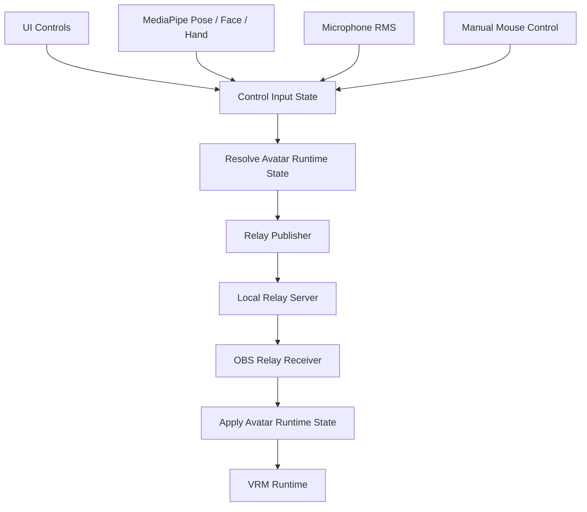

# OBS Render Code Cleanup Plan

## 目的

OBS側でだけ表情・口・まばたき・頭/体の追従が戻る、揺れる、カクつく問題を解くために、Control側とOBS Render側の責務、通信パケット、モデル適用処理を整理する。

この計画では、機能追加よりも「どこが正の状態か」を明確にすることを優先する。

## 現状診断

現状のコードはまだ動いているが、責務が `src/main.ts` に集まりすぎている。

- Three.js scene / camera / light初期化
- VRM / VRMAロード
- Setup UI作成
- MediaPipe pose / face / hand入力
- マイク口パク
- 自動まばたき / idle sway
- マウス手動操作
- 表情プリセット
- Relay送信
- Relay受信
- OBS Render側の補間とモデル適用

これらが同じファイル内で同じ状態変数を共有しているため、OBS側だけで以下のような競合が起きやすい。

- 受信した表情を適用した直後に、別経路が中立表情を再適用する
- motion補間とexpression適用が別タイミングで走り、古い状態が混ざる
- Control Preview用の状態更新とOBS Render用の状態更新が同じ関数を通り、意図しない復帰力が入る
- `state` / `staticState` / `motionState` / `expressionState` が並存し、どれが最終状態か読み取りづらい
- Relay再接続時の最新状態復元とリアルタイム更新が同じ扱いになっている

特に問題になっているのは、**Controller側は綺麗に見えているのにOBS側だけ戻りが強い** という点である。これはMediaPipeやVRMそのものより、OBS Render側の受信・補間・適用経路に原因がある可能性が高い。

## 整理後の基本方針

### 1. 入力と描画状態を分ける

Control側では入力を集める。

- MediaPipe
- microphone
- mouse/manual control
- UI controls
- VRMA playback controls

それらを直接OBSへ送るのではなく、いったん **正規化済みのAvatar State** に変換する。

OBS Render側は、Avatar Stateを受け取ってVRMへ適用するだけにする。

### 2. 正の状態を1つに寄せる

最終的には、OBS Renderが受け取るリアルタイム状態を次のような単位へ寄せる。

```ts
interface AvatarRuntimeState {
  sequence: number;
  sentAt: number;
  staticRevision: number;
  transform: AvatarTransform;
  look: LookSettings;
  pose: AvatarPose;
  expressions: AvatarExpressions;
  playback: AvatarPlaybackState;
}
```

ただし、すぐに1パケットへ統合するとリスクが高い。短期的には次の2系統に整理する。

- `staticState`: 低頻度の設定
- `runtimeState`: 高頻度の姿勢・表情

`motionState` と `expressionState` の並存は一時的な修正として有効だったが、長期的には `runtimeState` にまとめる。

### 3. OBS Render側は入力ロジックを持たない

OBS Render側でやってよいこと:

- VRM / VRMA assetの受信とロード
- `staticState` の適用
- `runtimeState` の受信
- 破棄すべき古いruntime frameの判定
- 表示用の軽い補間
- VRMへの適用

OBS Render側でやらないこと:

- MediaPipe由来かマイク由来かの判断
- まばたきモードや口パクモードの解決
- 入力のスムージング
- 中立状態への自動復帰判断
- UI状態から表情を再計算すること

## 目標アーキテクチャ



## データ設計

### Static State

低頻度で送る。変更時のみ送信する。

```ts
interface RelayStaticState {
  revision: number;
  avatarTransform: RelayAvatarTransform;
  look: RelayLookSettings;
  vrmaLoop: boolean;
}
```

対象:

- モデル位置
- 拡大率
- 全体Y回転
- lighting preset
- key / fill / rim設定
- VRMA loop

OBS側ではstatic stateに復帰力を持たせない。受け取った値をそのまま保持し、必要なら描画用にごく短く補間する。

### Runtime State

高頻度で送る。まずは30fpsを目標にし、詰まったら古いフレームを捨てる。

```ts
interface RelayRuntimeState {
  sequence: number;
  sentAt: number;
  pose: RelayPoseState;
  expressions: RelayExpressionState;
}
```

対象:

- head
- upperBody
- arms
- hands/fingers
- blink
- mouth
- emotion expression weights

OBS側ではruntime stateを「最新の目標値」として扱う。表情は補間を薄く、または即時適用寄りにする。

## 通信設計

### Relay Server

Relay serverは状態を解釈しすぎない。

やること:

- 最新の `asset` / `vrmaSlots` / `staticState` / `runtimeState` / `vrmaCommand` を保持
- 新規Render接続時に最新状態を順番に送る
- realtime系で送信先の `bufferedAmount` が詰まっていたら古いフレームを送らない

やらないこと:

- runtime stateをマージしない
- 表情だけ別に補正しない
- sequenceを作り直さない

### 送信頻度

MVPでは次を基本にする。

- `staticState`: 変更時のみ
- `runtimeState`: 30fps
- `vrmaCommand`: 操作時のみ
- `asset`: ファイル選択時のみ

15fps送信 + 強補間は、表情と口パクの追従が悪くなるため優先しない。OBS側の負荷が問題になったら、まずは古いフレーム破棄と適用処理軽量化で対応する。

## モデル適用設計

### Control Preview

Control Previewは入力確認用なので、入力処理と同じプロセス内で即時反映してよい。

ただし、将来の混乱を避けるため、Control Previewも可能なら `AvatarRuntimeState` を経由して描画する。

### OBS Render

OBS Renderは受信したstateだけを信じる。

処理順:

1. 古い `sequence` / `sentAt` を破棄
2. `runtimeTarget` を更新
3. poseは描画フレームで軽く補間
4. expressionsは補間を最小限にして適用
5. VRMへ一度だけ反映

重要:

- 同じフレーム内で表情を複数回適用しない
- 口パクOFFならControl側で `aa/ih/ou/ee/oh = 0` を作る
- OBS側で口パクOFFなどのモード判定をしない
- まばたきOFFならControl側で `blinkLeft/blinkRight = 0` を作る
- OBS側で表情プリセットとモーキャプ表情を再合成しない

## 分割するモジュール案

現在の `src/main.ts` から、段階的に以下へ切り出す。

### `src/avatar/avatar-state.ts`

Avatar Runtime State / Static Stateの型と初期値。

責務:

- neutral state作成
- runtime stateの丸め
- sequence付きstate生成
- stateの浅いvalidation

### `src/avatar/apply-avatar-state.ts`

VRMへ状態を適用する処理。

責務:

- poseをVRM humanoid bonesへ適用
- expressionsをexpressionManagerへ適用
- VRM expression updateの呼び出し位置を一元化

### `src/relay/publisher.ts`

Control側のRelay送信。

責務:

- static変更検出
- runtime送信間隔管理
- bufferedAmountの送信抑制
- asset / command送信は既存clientを利用

### `src/relay/receiver.ts`

OBS側のRelay受信。

責務:

- message typeごとの受信処理
- stale runtime frame破棄
- reconnect時の最新state適用
- debug用の最終受信時刻/sequence保持

### `src/render/render-page.ts`

OBS Render Pageの初期化。

責務:

- scene/camera/renderer生成
- Relay receiver接続
- render loop
- VRM asset load

### `src/control/control-page.ts`

Control Pageの初期化。

責務:

- UI作成
- MediaPipe / mic / manual input起動
- Control preview
- Relay publisher接続

## 段階的実装計画

### Phase 0: 観測を増やす

目的: 推測ではなく、OBS側で何が適用されているか見る。

- OBS Render debug overlayを `?debug=1` のときだけ表示
- 表示項目:
  - runtime sequence
  - runtime age ms
  - expression sequence
  - blinkLeft / blinkRight
  - aa
  - head yaw/pitch/roll
  - dropped stale frames
  - WebSocket bufferedAmount
- Playwrightでdebug overlayが通常OBS URLでは非表示であることを確認

### Phase 1: Runtime Stateへ統合

目的: `motionState` と `expressionState` の二重経路をなくす。

- `RelayRuntimeState` を追加
- Control側は `runtimeState` を30fpsで送る
- Render側は `runtimeState` を適用する
- 互換用に一時的に `motionState` / `expressionState` 受信は残すが、送信は止める
- テスト:
  - runtime stateの型・生成
  - 古いsequence破棄
  - 古いsentAt破棄

### Phase 2: OBS Render適用処理の一元化

目的: 表情やposeが複数箇所から上書きされるのを止める。

- `applyRuntimeStateToVrm` を作る
- OBS Render loopではこの関数だけがVRM pose/expressionを触る
- `applyRelayExpressions` などRender専用関数を整理
- 表情は `faceExpressionWeights` 共有変数ではなく `runtimeTarget.expressions` から適用
- テスト:
  - mouth OFF stateなら口系weightsが0になる
  - blink保持stateなら連続フレームで勝手に0へ戻らない

### Phase 3: Control側の状態解決を分離

目的: 入力ソースの選択と合成をControl側に閉じ込める。

- `resolveAvatarRuntimeState(inputState, appState)` を作る
- blink mode:
  - mocap
  - auto
  - off
- lip sync mode:
  - mocap
  - mic
  - off
- hand tracking offならhand/arm由来のtargetをneutralにする
- テスト:
  - mode別の表情合成
  - off時に値が残留しない
  - mocap hold時に値が維持される

### Phase 4: main.ts分割

目的: 今後の修正でまた絡まないようにする。

- `main.ts` は起動ルーティングだけに近づける
- Control page / Render page / shared scene helpersへ分割
- 一度に大移動せず、テストが通る単位で分ける

## 受け入れ条件

### 動作

- Control PreviewとOBS Renderで、同じ入力に対する表情が大きくズレない
- 口を開けたままならOBS側でも開いた状態を維持できる
- 目を閉じたままならOBS側でも閉じた状態を維持できる
- lip sync offでOBS側の口が勝手に動かない
- blink offでOBS側の目が勝手に戻らない
- hand tracking offで腕/手がMediaPipe由来で動かない
- lighting / transform変更でOBS側がブルブル戻らない

### 検証

- `npm run test`
- `npm run lint`
- `npm run build`
- `npm run test:e2e`
- Chrome Control + OBS Render相当URLの手動確認

### OBS URL

```text
http://127.0.0.1:5173/?obs=1&transparent=1
```

debug確認時:

```text
http://127.0.0.1:5173/?obs=1&transparent=1&debug=1
```

## 実装時の注意

- 大きな分割前には必ずコミットする
- 1コミットで1段階にする
- 既存の動くVRM/VRMAロードを壊さない
- `local-assets/` はコミットしない
- OBS Render側に入力モード判断を増やさない
- 表情とposeを同じフレームで何度もVRMに適用しない
- 互換用の旧メッセージは、runtimeStateが安定してから削除する

## 次にやること

最初の実装タスクは Phase 0 のdebug overlay追加がよい。

理由:

- OBS側で実際に受け取っている値を確認できる
- 表情値が通信時点で戻っているのか、VRM適用時に戻っているのか切り分けできる
- 以降のruntimeState統合の検証に使える

Phase 0で値が正しいのにモデルだけ戻るなら、VRM適用経路が原因。値自体が戻っているなら、Control側のstate解決かRelay送信が原因である。
