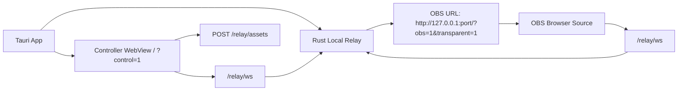

# Tauri Rust Relay Migration Plan

確認日: 2026-06-05

## 目的

VPlant3Dを配布可能なTauriアプリにするため、現在Nodeで動いているLocal RelayをRust/Tauri側へ移植する。

狙いは、ユーザーが別ターミナルで `npm run dev` を起動しなくても、アプリ起動だけで以下が成立すること。

- Controller UIが開く
- Local Relayが `127.0.0.1:<port>` で起動する
- OBS Browser Sourceへ貼るRender URLが表示される
- Controllerで読み込んだVRM / VRMAがOBS Renderへ届く
- Controllerで生成した表情・頭・体・手動操作・マイク口パクなどのruntime stateがOBS Renderへ届く

## 結論

次の実装は、Node relay sidecarではなく **Tauri内蔵Rust relayの最小移植** を第一候補にする。

理由:

- 配布物としてNode runtimeを同梱しなくてよい
- Tauriアプリ終了時のrelay終了管理をRust側で持ちやすい
- OBS Renderは引き続きOBS Browser Sourceで動くため、Tauri WebView差分を描画出力へ持ち込まない
- いま問題になっている「モーション伝達」はWebSocket relayの責務であり、Rustで再実装すれば `.app` 単体利用に近づける

ただし締切前なので、Node relayの全機能を一度に完全移植しない。まずはVPlant3DのMVPに必要な互換面だけを通す。

## 参照情報

- Tauri State Management: https://v2.tauri.app/ja/develop/state-management/
- Tauri Configuration: https://v2.tauri.app/reference/config/
- Tauri Sidecar: https://v2.tauri.app/fr/develop/sidecar/
- Tauri Node.js Sidecar: https://v2.tauri.app/es/learn/sidecar-nodejs/
- Axum: https://docs.rs/axum/
- tower-http ServeDir: https://docs.rs/tower-http/latest/tower_http/services/struct.ServeDir.html

VPlant3Dでの判断:

- Tauri公式のState管理を使い、relay handle / port / shutdown signalをTauri stateとして持つ
- sidecarはfallback候補として残すが、最初の本線にはしない
- Rust HTTP/WebSocket実装は `axum` / `tokio` / `tower-http` を第一候補にする

## 現在のNode Relay責務

`server/vplant-relay.mjs` が現在担当していること。

### HTTP

- Vite middlewareによるfrontend配信
- `POST /relay/assets?kind=vrm|vrma`
- `GET /relay/assets/:id`
- `GET /relay/debug-log`
- `DELETE /relay/debug-log`
- `GET /relay/health`

### WebSocket

- `/relay/ws`
- `hello` による `control` / `render` role登録
- active control guard
- latest message replay
- realtime stateの中継
- `bufferedAmount` が大きいRenderへのrealtime skip
- debug sample収集

### 保持している最新状態

- latest VRM asset message
- latest VRMA slots message
- latest static state
- latest runtime state
- latest legacy motion / expression state
- latest VRMA command
- debug events

## Rust Relay最小互換スコープ

### Must

- Tauri起動時にRust relayを起動する
- `GET /relay/health` を返す
- build済み `dist/` を `/?control=1` / `/?obs=1` として配信する
- `POST /relay/assets?kind=vrm|vrma` を受ける
- `GET /relay/assets/:id` を返す
- `/relay/ws` でWebSocketを受ける
- `hello` roleを扱う
- `runtimeState` をControllerからOBS Renderへ中継する
- `asset` message、`staticState`、`vrmaSlots`、`vrmaCommand` を中継する
- 新規Render接続時にlatest asset / stateをreplayする
- Web fallbackのNode relayを壊さない

### Should

- active control guardを移植する
- debug sampleと `/relay/debug-log` を移植する
- realtime stateが詰まるRenderへ送信しすぎない
- 起動portをUIへ渡し、OBS URL生成へ反映する
- Tauri終了時にrelay taskを停止する

### Later

- Rust relayとNode relayの完全な挙動比較テスト
- assetのTTL / cleanup
- port衝突時の自動fallback
- Windows実機確認
- macOS DMG bundle失敗原因の修正
- Node sidecar fallback

## アーキテクチャ案



## 実装方針

### 1. Rust moduleを分ける

候補:

- `src-tauri/src/relay/mod.rs`
- `src-tauri/src/relay/server.rs`
- `src-tauri/src/relay/state.rs`
- `src-tauri/src/relay/assets.rs`
- `src-tauri/src/relay/messages.rs`

`lib.rs` にHTTP/WebSocketの詳細を書き込まない。Tauri startupからrelay moduleを呼ぶだけにする。

### 2. WebSocket messageはJSON文字列として中継する

最初から全schemaをRust型に起こさない。既存Node relayも文字列中継に近いので、初期実装は以下に留める。

- `type` と `role` だけ軽くparseする
- latest判定に必要な `type` だけ見る
- 中身のpose/expressionはRustでは解釈せず、そのままRenderへ渡す

これにより、表情・頭・体・VRMAなどの既存Web側実装を壊しにくい。

### 3. Assetはメモリ保持から始める

Node relayと同じく、最初はVRM / VRMAをメモリに保持する。

- 上限はNode版と同じ `256 MiB`
- idはUUID
- nameとcontent-typeを保存
- `cache-control: no-store`

締切前に永続保存や最近使ったモデル管理までは広げない。

### 4. frontend配信

配布buildでは `dist/` をRust relayから配信する。

dev時は次のどちらかを選ぶ。

- Vite dev serverを維持し、Rust relay移植はbuild確認を優先する
- Rust relayが `dist/` またはVite proxyを返す

最初の目標では、Web fallback維持を優先し、dev中は既存Vite/Node relay fallbackを残してよい。

### 5. Tauri window URL

最終的にはTauri windowもRust relayのURLを開く。

```text
http://127.0.0.1:<port>/?control=1
```

OBSは同じrelayのRender URLを開く。

```text
http://127.0.0.1:<port>/?obs=1&transparent=1
```

## テスト計画

### Rust unit tests

- latest message replay順がNode版と同等
- `runtimeState` がlatest runtimeとして保持される
- `asset` messageがVRM latestとして保持される
- active control guardが古いcontrolのrealtimeを拒否する
- asset kind validation
- asset size limit
- health payload

### Rust integration-ish tests

可能なら `tokio::test` で小さなserverを起動して確認する。

- `/relay/health`
- `/relay/assets` upload/download
- `/relay/ws` でcontrolからrenderへ `runtimeState` が届く
- render再接続時にlatest `runtimeState` が届く

### Web tests

- 既存 `npm run test`
- 既存 `npm run test:e2e`
- OBS URL生成が実portを使えるようになった場合は純ロジックテストを追加

### Manual tests

- Tauri app起動
- ControllerでVRM読み込み
- OBS Render URLをOBS Browser Sourceへ貼る
- Controller側の手動操作がOBS側へ反映される
- マイク口パクがOBS側へ反映される
- 表情プリセットがOBS側へ反映される
- VRMA再生commandがOBS側へ反映される

## 段階的な実装Step

### Step 0: 作業前確認

- 現在のWeb fallbackをテストする
- 現在の変更がコミット済みか確認する
- Rust依存追加のため公式docsとcrate docsを確認する

### Step 1: Rust relay skeleton

- `axum` / `tokio` / `tower-http` / `serde_json` / `uuid` などを追加
- `/relay/health` を返す最小serverを作る
- Tauri startupで空きportにserverを起動する
- `cargo test` を通す

### Step 2: Static frontend配信

- `dist/` をRust relayから返す
- SPA fallbackで `index.html` を返す
- `/?control=1` と `/?obs=1` が同じbundleを開けるようにする

### Step 3: WebSocket relay

- `/relay/ws` を実装
- connected clientsを保持する
- `hello` roleを記録する
- controlからrenderへJSON文字列をbroadcastする
- latest replayを実装する

### Step 4: Runtime state互換

- `runtimeState` をlatestとして保持する
- `staticState`、`vrmaSlots`、`vrmaCommand`、`asset` をlatestとして保持する
- legacy `motionState` / `expressionState` は受信互換だけ残す

### Step 5: Asset upload/download

- `POST /relay/assets?kind=vrm|vrma`
- `GET /relay/assets/:id`
- Web側の既存upload処理がRust relayでも動くことを確認する

### Step 6: Tauri window統合

- Tauri起動時にRust relayを起動する
- Controller windowをRust relay URLへ向ける
- UIのOBS URL表示が実portを使えるようにする
- `npm run dev` fallbackはそのまま残す

### Step 7: Debug / handoff

- `/relay/debug-log` を必要最小限で移植する
- macOS実機確認項目を更新する
- DMG bundle失敗は別issueとして残す

## Stop Conditions

最初の大きなgoalでは、以下のどちらかで止める。

### 成功

- Tauri appがRust relayを起動する
- ControllerがRust relay経由で開く
- OBS Render URLがRust relayを指す
- VRM / runtimeState / 表情 / マイク口パク / 手動操作の少なくともMVP経路がOBSへ届く
- Web fallbackの `npm run dev` が壊れていない
- `npm run test`、`npm run lint`、`npm run build`、`npm run test:e2e`、`cargo test` が通る

### 部分成功

- Rust relay skeletonと主要HTTP/WebSocketの一部が実装済み
- 何が未移植で、なぜOBS側へ届かないかが明確
- Node relay fallbackでデモは継続可能
- 次にやる具体的な差分がdocs/work-logへ残っている

## リスクと回避策

### WebSocket実装のバグでOBS同期が壊れる

回避:

- Node relayを残す
- Rust relayは `tauri:dev` の新経路として段階導入する
- Web fallback E2Eを必ず通す

### Rust側でschemaを厳密にしすぎて既存messageを落とす

回避:

- 初期実装ではJSON文字列中継を基本にする
- `type` だけparseし、unknown messageもbroadcastする

### Asset uploadで大きなVRMを扱えない

回避:

- Node版と同じ上限から始める
- メモリ保持でまず通す
- 配布後にTTLやdisk cacheを検討する

### Tauri buildでDMGが失敗する

回避:

- relay移植goalとは別に扱う
- `.app` 起動確認を先に行う
- DMG修正は配布直前タスクへ分離する

## 次のGoal案

```text
/goal Implement the first Rust/Tauri Local Relay for VPlant3D so the desktop app can transmit motion to OBS without a manually started Node relay. Read AGENTS.md, docs/work-log.md, docs/tauri-rust-relay-migration-plan.md, docs/tauri-controller-technical-plan.md, docs/tauri-distribution-readiness-task-list.md, docs/obs-architecture-redesign.md, docs/tdd-for-codex.md, and docs/human-handoff-board.md first. Keep the existing Web fallback and Node relay working.

Primary goal:
Port the minimum required Node relay behavior into the Tauri Rust backend: local HTTP server, WebSocket relay, latest state replay, runtimeState motion/expression transport, VRM/VRMA temporary asset upload/download, health endpoint, and Controller/OBS URL integration.

Scope:
1. Audit server/vplant-relay.mjs and src/relay/* before editing.
2. Add a Rust relay module under src-tauri/src/relay/ with small, testable pieces.
3. Add the smallest safe Rust dependencies after checking primary docs/crate docs.
4. Start a localhost Rust relay from Tauri startup, preferring 127.0.0.1 and a stable default port, with a safe fallback if 5173 is occupied.
5. Serve the built frontend through the Rust relay for Tauri builds, preserving ?control=1, ?obs=1, and ?transparent=1 behavior.
6. Implement /relay/health, /relay/ws, POST /relay/assets?kind=vrm|vrma, GET /relay/assets/:id, and minimal /relay/debug-log if feasible.
7. WebSocket relay must preserve raw JSON message compatibility and at least handle hello roles, runtimeState latest replay, staticState, asset, vrmaSlots, and vrmaCommand.
8. Ensure Controller-generated runtimeState motion/expression data reaches OBS Render through the Rust relay.
9. Keep Node relay and npm run dev as fallback; do not remove scripts/tauri-relay-dev.mjs until Rust relay is verified.
10. Update README.md, docs/work-log.md, docs/human-handoff-board.md, and docs/tauri-distribution-readiness-task-list.md.

Constraints:
- Do not rewrite OBS Render behavior beyond host/port integration needed for Rust relay.
- Preserve VRM/VRMA loading, mic mouth, camera mode, manual control, expression preset buttons, OBS transparent mode, ?obs=1, ?transparent=1, and ?control=1.
- Do not resume hand tracking or arm IK work.
- Do not commit local-assets files.
- Prefer JSON string pass-through over strict Rust schema parsing for runtime messages.
- If macOS permissions, OBS, DMG bundling, Windows, or model assets require human action, document exact steps in docs/human-handoff-board.md instead of blocking.

Testing:
Add Rust unit/integration tests for relay state, latest replay, health payload, asset validation, and WebSocket runtimeState forwarding where feasible. Run npm run test, npm run lint, npm run build, npm run test:e2e, cargo test, cargo fmt --check, and try npm run tauri:dev and npm run tauri:build. If a command cannot run or fails, document the exact blocker and fallback.

Stop conditions:
Stop when the Tauri app can start a Rust relay and Controller-to-OBS runtimeState/asset transport works, or when a partial Rust relay prototype exists with the exact missing piece and Node fallback path documented. Commit and push stable verified changes.
```
